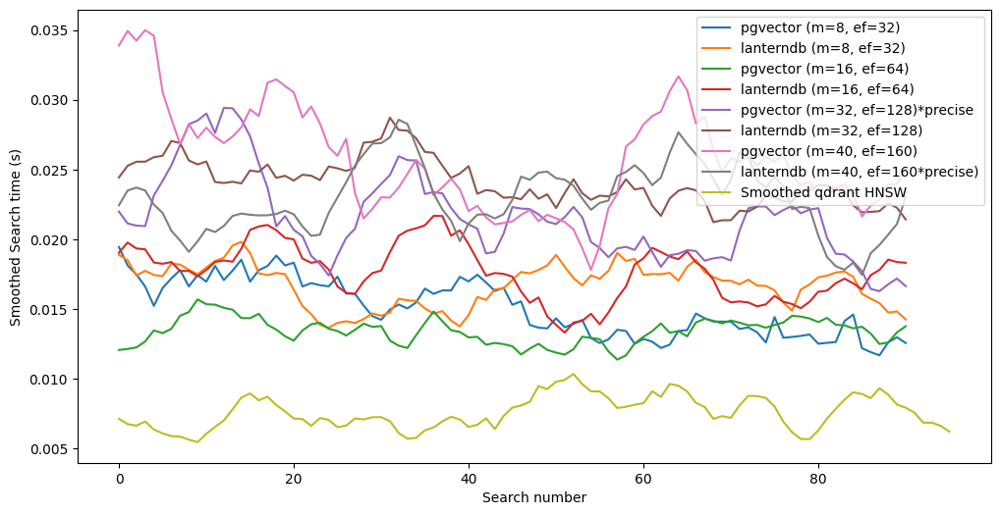
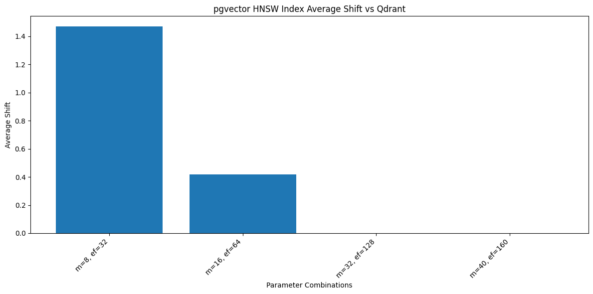
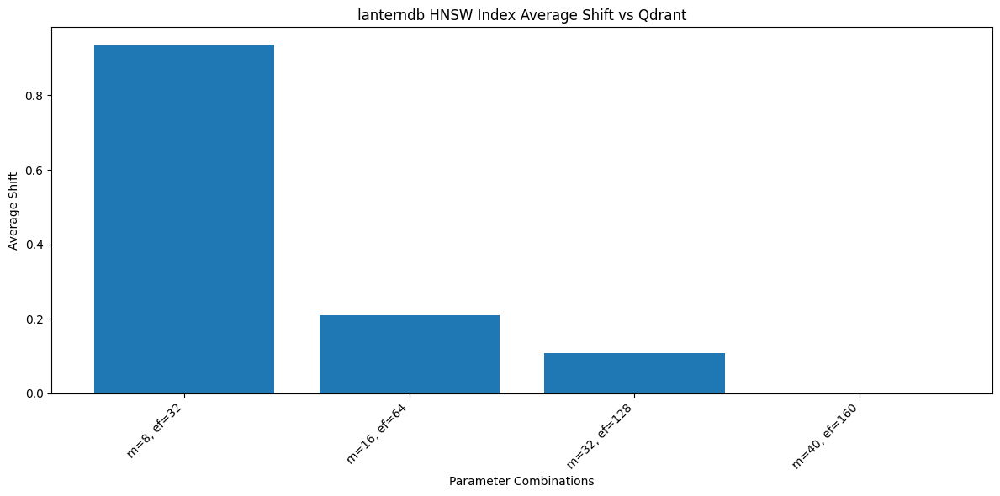

  

    <b>Offering a product suite for putting arbitrary models into production semantic search and retrieval-augmented LLM-chat experiences on your company's data</b>

<strong><a href="https://docs.arguflow.ai">Documentation</a> • <a href="https://search.arguflow.ai">Competitive Debate Search Demo</a> • <a href="https://chat.arguflow.ai">Competitive Debate Chat Demo</a> • <a href="https://discord.gg/CuJVfgZf54">Discord</a>

</strong>

# It's time to ditch your specialized vector database for postgresql

The objective behind this notebook was to assess the feasibility of substituting our system's SVD, [Qdrant](https://qdrant.tech/), with [pgvector](https://github.com/pgvector/pgvector) or [lanterndb](https://lantern.dev/) - AKA postgresql + [usearch](https://www.unum.cloud/). Employing an OLTP solution like these postgresql focused ones would offer the advantage of utilizing a transactional database with schema and transaction support for both objects and vectors, thereby eliminating the need for external database joins during diverse search operations.

## Star us on Github at [github.com/arguflow/arguflow](https://github.com/arguflow/arguflow)!!!!

## Findings

Both [pgvector](https://github.com/pgvector/pgvector) and [lanterndb](https://lantern.dev/) are **faster** than [Qdrant](https://qdrant.tech/) and **can** be *equally accurate* after tuning. This means that you should first place your vectors in both [Qdrant](https://qdrant.tech/) and [pgvector](https://github.com/pgvector/pgvector) or [lanterndb](https://lantern.dev/) then tweak your HNSW index params, `m` and `ef_construction`, such that the postgres solution is just as accurate as [Qdrant](https://qdrant.tech/). Following that, move forward with postgres alone.

If you are not already using postgres and do not have requirements for an ACID compliant solution, then we would still recommend [Qdrant](https://qdrant.tech/). It has a lot of convience features, supports quantization, and does not require tuning to be accurate. 

### Speed Comparisons

### Accuracy comparisons

### Replicating our results
1. Download the dataset via [this link](https://drive.proton.me/urls/FED1ABWG70#ItjHZqiPpUao). This is roughly the [DebateSum dataset](https://aclanthology.org/2020.argmining-1.1/), but with some improved parsing loggic and dedup detection as noted on [our docs](https://docs.arguflow.ai).
2. Place the dataset into the same directory as this notebook
3. `docker compose up -d`
4. `cat .env.dist > .env`
4. Run all to duplicate our findings
